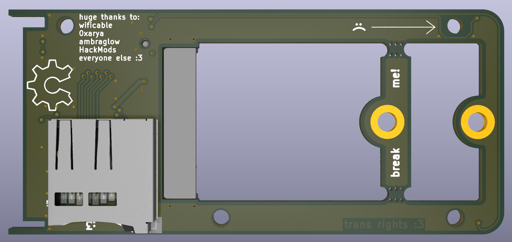

# ThinkMoth Expresscard to NVMe 
An ExpressCard to NVMe adapter, except this one actually ships! 

The ThinkMoth ExpressCard to NVMe is a low cost, open source adapter for using an M.2 2230/2242 NVMe SSD in an ExpressCard34/54 socket. It features a microSD card slot to enable booting from the SSD, and optional status LEDs for SD and PCIe activity so you can look at cool lights. 

Up to PCIe 3.0 @ 1x is supported (it'll be 2.0 on nearly every machine, though), and the only limitation on drives is power consumption. This board will only provide ~1a @ 3.3v, which can cause issues with higher-performance SSDs.

It also includes a yet-to-be-designed 3D printed chassis, with an EC54-specific version also in the works!

Please note that this board *only* supports NVMe drives!

Update 20/9/25:
Prototype PCBs have been ordered :) 

# More info:
1. ### What SSD works best?:
    - ExpressCard is super power limited with only 3v3@1A available to the SSD, so anything slower/low power drives should work fine. Higher end drives might have issues. This adapter only provides a PCIe 1x link, so there isn't much reason to get the high end drives.
  
2. ### How does booting from the SSD work?
    - Booting from the SSD works either via a bootloader being installed on the microSD card, which then loads the OS from the SSD. Alternatively, if you are able to add custom drivers, you can use the NVMe driver via Coreboot or similar for basically native operation.
  

# Production status:
All parts have been ordered for a prototype batch of 10x units. PCBs should arrive in a week or two, and assuming it all works, a "production" batch of 25x units will be ordered!

# Part list:
| Part                   | Model                        | Link                                                                               |
|------------------------|------------------------------|------------------------------------------------------------------------------------|
| ExpressCard connector  | Amphenol  10030570-2112LF    | [https://www.arrow.com/en/products/10030570-2112lf/amphenol-fci](https://www.arrow.com/en/products/10030570-2112lf/amphenol-fci)                     |
| Mid-mount M.2 M-key    | Amphenol MDT180M03001        | [https://www.digikey.com.au/en/products/detail/amphenol-cs-fci/MDT180M03001/5810365](https://www.digikey.com.au/en/products/detail/amphenol-cs-fci/MDT180M03001/5810365) |
| SD card controller     | Genesys Logic GL823K         | [https://www.lcsc.com/product-detail/C284879.html](https://www.lcsc.com/product-detail/C284879.html)                                   |
| microSD card socket    | Sofng TF-009                 | [https://www.lcsc.com/product-detail/C428466.html](https://www.lcsc.com/product-detail/C428466.html)                                   |
| 1.5A fuse              | BHFuse BSMD0805L-150         | [https://www.lcsc.com/product-detail/C914095.html](https://www.lcsc.com/product-detail/C914095.html)                                   |
| 2x 4k 6.3v resistor    | Yageo RC0402FR-073KL         | [https://www.lcsc.com/product-detail/C137987.html](https://www.lcsc.com/product-detail/C137987.html)                                   |
| 2x 0r 6.3v resistor    | Panasonic ERJ2GE0R00X        | [https://www.lcsc.com/product-detail/C242160.html](https://www.lcsc.com/product-detail/C242160.html)                                   |
| 4x 0.1uF 6.3v capacitor| Yageo CC0402KRX7R7BB104      | [https://www.lcsc.com/product-detail/C60474.html](https://www.lcsc.com/product-detail/C60474.html)                                    |
| Blue LED               | Meihua MHT192WDT-ICE         | [https://www.lcsc.com/product-detail/C389522.html](https://www.lcsc.com/product-detail/C389522.html)                                   |
| Pink LED               | Xinglight XL-1608UPC-06      | [https://www.lcsc.com/product-detail/C2977076.html](https://www.lcsc.com/product-detail/C2977076.html)                                  |

# Doing it yourself:
Wanna do it yourself? Check back here after I've validated the prototype boards, and I'll have a copy of the production gerber .zip, as well as the JLCPCB order settings required!

# Credits
A very big thank you to [Ambra](https://github.com/ambraglow/) for the original board outline, cutout, and EC footprint, and also to [Wifi](https://github.com/a-little-wifi/) and [Arya](https://github.com/CRImier/) and everyone else for all of the help and advice :3 

